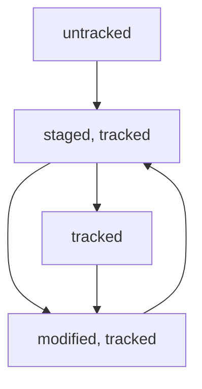

# Useful Git commands

## Initial commands

Create new repository

```
mkdir repo && cd repo
git init
```

Link repo with a remote

```
git remote add origin git@github.com:alexey-mavrin/repo.git
```

where `origin` is the conventional name.
Note that `repo` should already exist.

## Branchs and commits

Set the default branch

```
git config init.defaultBranch main
```

Create commit

```
cat > file.txt << EOF
Hello
EOF

git add file.txt
git commit -m "file.txt: some change"
```

Push commits and link branch name and the remote

```
git push -u origin main
```

or just push commits

```
git push
```

# Git info and glossary

## Commit Hash

Commit Hash is the long hex string, uniquely identified the commit.
It corresponds to SHA-1 checksum.

## Git log

To get the commit history, use the following command:
```
git log
```

This command presents the list of commit, starting from the most recent;
for each commit, it shows
- commit hash
- commit author
- date of the commit
- commit message

Note: it is worth mentioning, that one can use shortened version of git hash,
long enough for uniquely select the commit in this particular repo. Those shortened
hashes could be produced by `git log --oneline` command.

## HEAD

`HEAD` refers to two things in git.
1. File `.git/HEAD`, containing the reference to the file with the last commit made
2. The position in the current branch, from which successive commit will be made.

```
# cat .git/HEAD
ref: refs/heads/main

# cat .git/refs/heads/main
2ce5430bdd3a1344f84096361c244a411809cb0a
```

## File states

There are several file states in git:
- untracked
- tracked
- staged
- modified

Initially, when file is created in git repository, it has the `untracked` state.
Then, with `git add file_name`, it moves to `staged` state. It also has `tracked`
state, ant remains in `tracked` all the time until the file is removed from the repo.

When changes are committed, the file state is just the `tracked`.

After the `staged` or `tracked` file is modified, and before `git add` command
is issued, the file has the `modified` state.



Note that file states could be observed via `git status` command.

## Git status command

With the output of the `git status` command you can see what is going on
with the file. Below is the correspondance between git file state and
`git status` output

| `git status` output | git file state |
|-|-|
| `Untracked files` | shows untracked files |
| `Changes not staged for commit` | shows modified files |
| `Changes to be committed` | shows staged files |
| `nothing to commit, working tree clean` | all files are in tracked state |

Keep in mind that file could be in `staged` and `modified` state at the same moment.

## Commit messages

In general, commit messages should be
- concise
- informative
- conformed to the accepted scheme

As an example, it could contain the changed entity/subsystem name, the colon,
and the description of the change made, like this:
```
~/Learn/Git/repo1# git log --oneline
d25360c (HEAD -> main, origin/main) README.md: git status command
4abc0a4 README.md: git file states
527a2da README.md: HEAD
2ce5430 README.md: add info on git log
31dd266 README.md: add info on commit hash
0fbe8ab README.md: add some git commands
```
